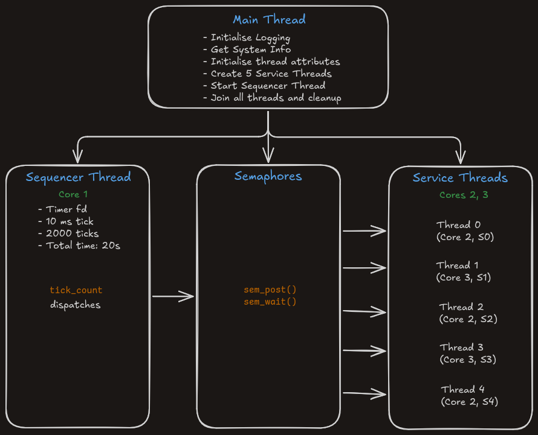
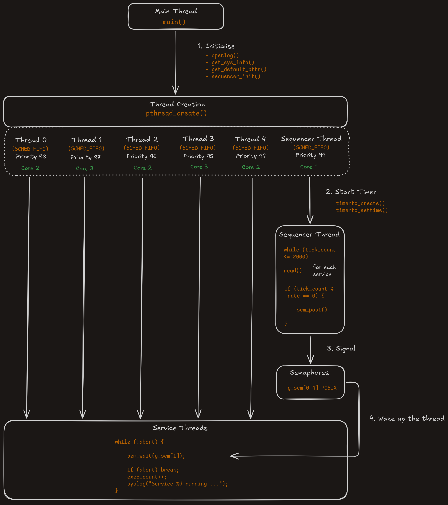
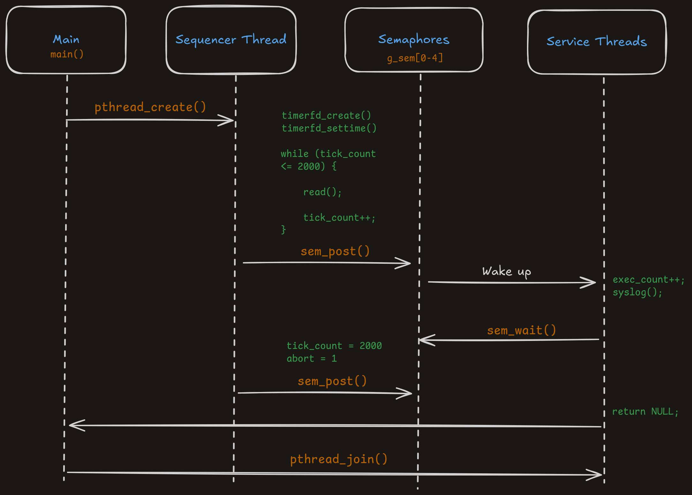

# Introduction
This repo contains the code for the assignments completed for the *University of Colorado Boulder* Course: [Real-Time Embedded Systems Concepts and Practices](https://www.coursera.org/learn/real-time-embedded-systems-concepts-practices)

# C1A5: Overview


<sub>*Fig. 1: C1A5 Demo*</sub>

This project uses a *realtime* sequencer dispatching periodic tasks via semaphores. In this way it emulates a realtime Interrupt Service Routine (ISR) used in embedded systems. This repo is designed to learn real time programming concepts in a general purpose OS (here, Linux) using POSIX realtime extensions.

The assignments progress from `C1A1` to `C1A5` with increasing complexity to learn the following concepts:
- Learn real-time scheduling concepts (`SCHED_FIFO`, priorities, CPU affinity)
- Practice concurrent programming with `pthreads` and semaphores
- Understand timer-based systems using `timerfd_create()` and `timerfd_settime()` for precise timing
- Build a deterministic sequencer that dispatches periodic tasks with *sub-millisecond* accuracy

## Build Instructions
```
# Clean the project directory
make clean

# Build the final executable
make build

# Run
sudo ./main.out
```


## Architecture Overview

<sub>*Fig. 2: Architecture Overview*</sub>


<sub>*Fig. 3: Detailed Overview*</sub>


<sub>*Fig. 4: Sequence Diagram*</sub>

# Assignment Brief
The assignments are tagged according to the course structure.
- `C1A1` : Get system information using `utsname.h`
- `C1A2` : Creating sum function for multiple threads, clean and modular project structure
- `C1A3` : Setting thread attributes and scheduler policy `SCHED_FIFO`
- `C1A4` : Implementing **Asymmetric Multi-Processing (AMP)** in Linux User Space using `SCHED_FIFO` & core pinning
- `C1A5` : Implementing a **generic sequencer** for regular interrupts from the kernel to emulate a hard real time based Interrupt Service Routine (ISR)
