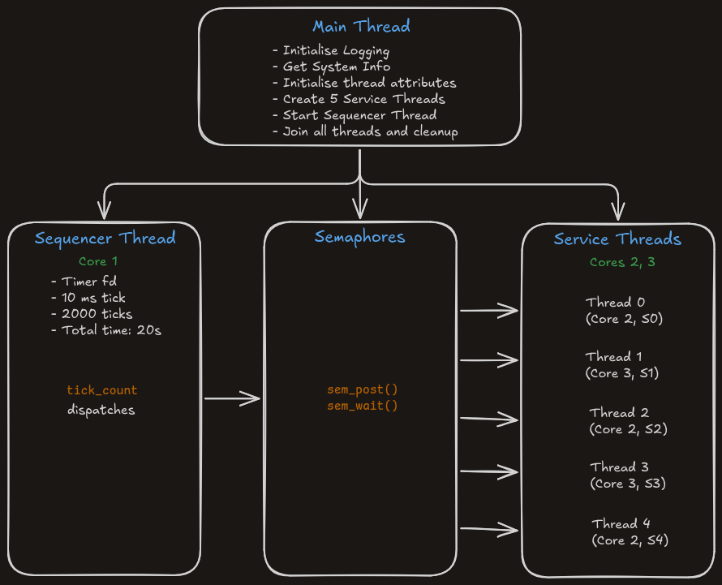
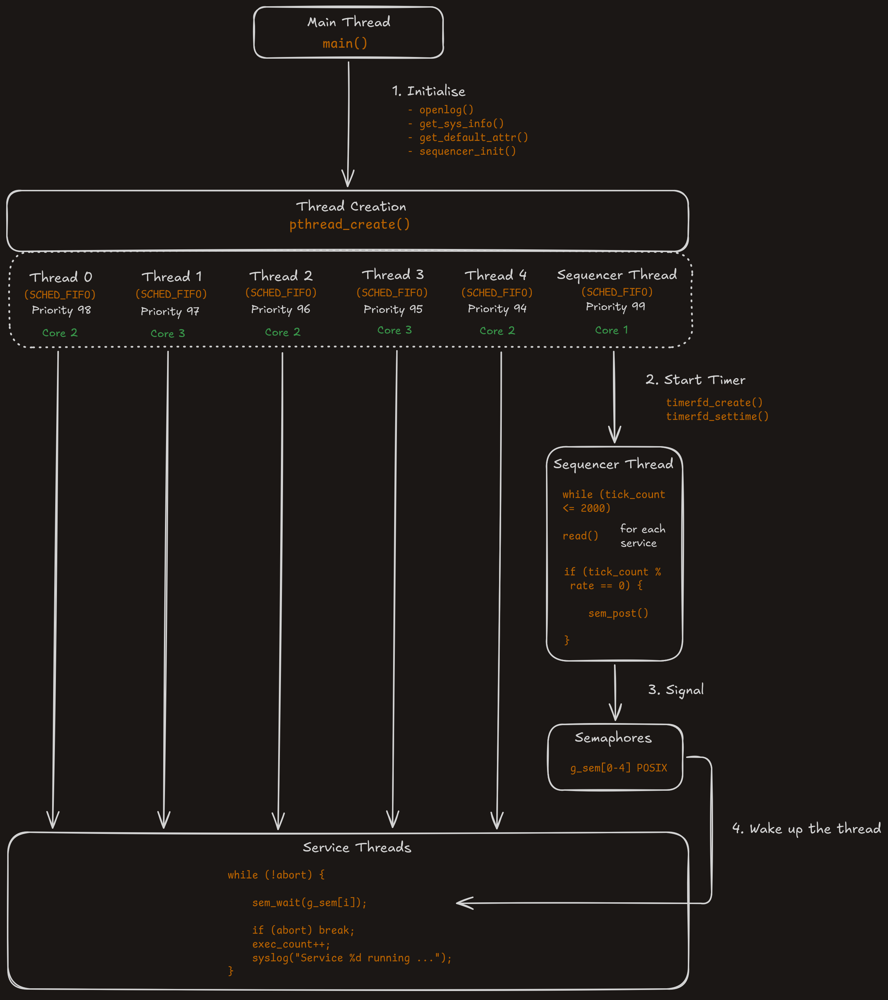
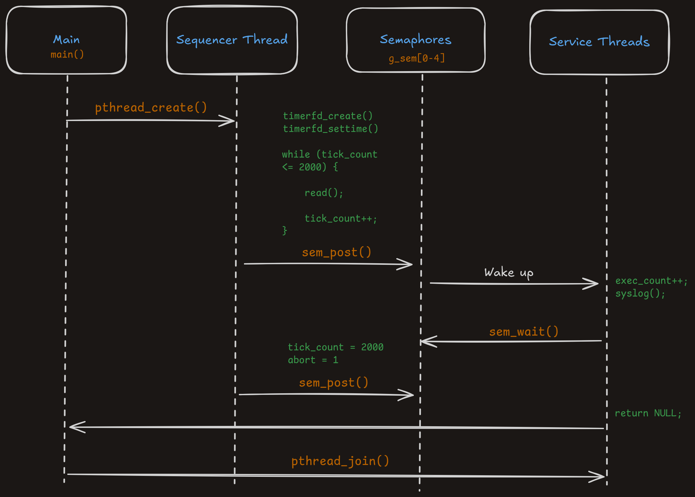

# Introduction
This repo contains the code for the assignments completed for the *University of Colorado Boulder* Course: [Real-Time Embedded Systems Concepts and Practices](https://www.coursera.org/learn/real-time-embedded-systems-concepts-practices)


<sub>*Fig. 1: C1A5 Demo*</sub>

# C1A5: Overview
## Build Instructions
Each assignment directory has its own `Makefile`.
```
# Clean the project directory
make clean

# Build the final executable
make build

# Run
sudo ./main.out
```


## Architecture Overview

<sub>*Fig. 2: Architecture Overview*</sub>


<sub>*Fig. 3: Detailed Overview*</sub>


<sub>*Fig. 2: Sequence Diagram*</sub>

# Assignment Brief
The assignments are tagged according to the course structure.
- `C1A1` : Get system information using `utsname.h`
- `C1A2` : Creating sum function for multiple threads, clean and modular project structure
- `C1A3` : Setting thread attributes and scheduler policy `SCHED_FIFO`
- `C1A4` : Implementing **Asymmetric Multi-Processing (AMP)** in Linux User Space using `SCHED_FIFO` & core pinning
- `C1A5` : Implementing a **generic sequencer** for regular interrupts from the kernel to emulate a hard real time based Interrupt Service Routine (ISR)
